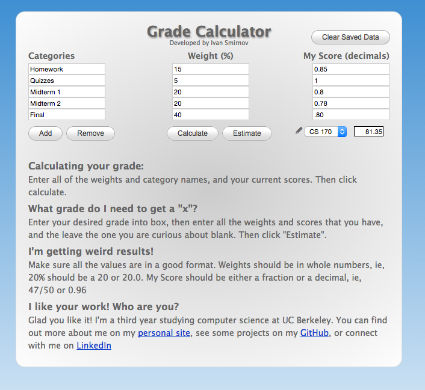

# Grade Calculator [v2.1]
***

`Grade Calculator` is a web based calculator that allows students to calculate potential course grades.

### Screenshot

    
### Usage
    
Extract this folder to a web host. For cookies to work, this needs to be hosted somewhere, rather than a locally opened html file.
    
### FAQ
    
> How do I calculate my grade?
    
Enter all of the weights and category names, and your current scores. Then click calculate.
    
> What grade do I need to get a "x"?
    
Enter your desired grade into box, then enter all the weights and scores that you have, and the leave the one you are curious about blank. Then click "Estimate".
    		
> I'm getting weird results!

Make sure all the values are in a good format. Weights should be in whole numbers, ie, 20% should be a 20 or 20.0. My Score should be either a fraction or a decimal, ie, 47/50 or 0.96
	   
#### License
    
`Grade Calculator` is licensed with GPL. 
  
#### Contributors
Ivan Smirnov (http://ivansmirnov.name)

